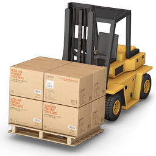

# What is the Forklift?

Forklift is an API application developed with go that enables virtual server migration from vcenter virtualization environment to openstack environment.

It's exports the vmdk file of a virtual server from the vcenter environment and converts it to QCOW2, which is the format that the KVM virtualization environment can understand. Then, in the openstack environment, it first creates an image, then creates a volume from this image and an instance from this volume. In the last step, it makes the instance accessible in the openstack environment by assigning a floating ip.

# Environment

- Rabbitmq: Forklift works asynchronously. When a request is received from the API, the message is queued and it performs the migration tasks in a certain order.
- Mongodb: Forklift writes them to the database in order to keep the states of the migration tasks and to be able to store the history.
- Vault: Forklift designed to read sensitive data such as vcenter passwords from the vault.

# Api Doc

Swagger is used for api documentation. It can be accessed at /api/swagger/index.html when the application is run.